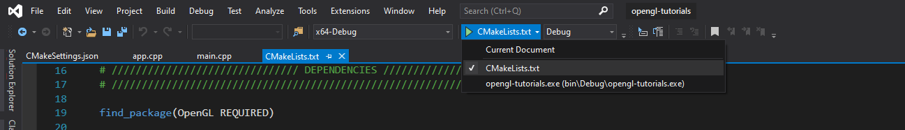
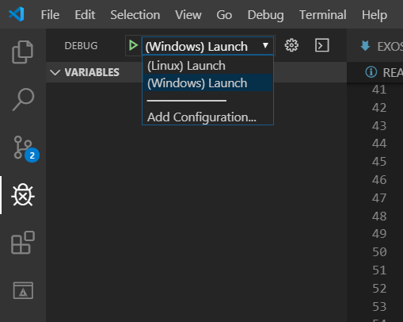

[](https://github.com/guillaume-haerinck/voxel-editor/actions)
[](https://github.com/guillaume-haerinck/voxel-editor/actions)
[](https://opensource.org/licenses/MIT)

<p align="center">

</p>

# Cube Beast Editor

Small voxel map editor with an Entity Component System (ECS) architecture.

Supports WASM build so it can be played on any web-browser like Chrome, Firefox or Safari. Just run the content of the `www` folder on a web server.

<p align="center">

</p>

## Table of Contents

+ [Getting started](#Getting-Started)
    + [Build on desktop](#Build-on-desktop)
    + [Build for the web as wasm](#Build-for-the-web-as-wasm)

## Getting Started

### Prerequisites

You need to install [CMake](https://cmake.org/) to build the project, and a C++ compiler which handles C++17.

#### Linux

```bash
sudo apt-get install build-essential cmake libsdl2-dev libglu1-mesa-dev mesa-common-dev
```

#### Windows

To get the MSVC compiler, you need to install [Visual Studio](https://visualstudio.microsoft.com/) (and not VSCode), and select C++ development during installation.

### Build on desktop

You can handle the `CMakeLists.txt` in any way you like, here's some way to use it :

#### `Option 1: CLI`

Go to the folder of this project and run :

```bash
mkdir build
cd build
cmake ..
make
```

#### `Option 2: Visual Studio (Windows only)`

Open this folder with the `CMake...` option in file->open on Visual Studio, and run the project.



#### `Option 3: VSCode`

Use the `CMakeTools` plugin, build with `f7` then run with `f5` (But be carefull to be on the right platform, there is a launch file for windows and for linux).



### Build for the Web as WASM

This project support Web Assembly, so it can run in a browser like Google Chrome or Firefox ! You need to install the [Emscripten](https://emscripten.org/) compiler to get started. If you are on windows, it is recommended to use [linux subsystem for windows (WSL 2)](https://docs.microsoft.com/fr-fr/windows/wsl/install-win10), and run the next steps with a linux command line.

#### Install Emscripten

These steps might change in the future. Go check Emscripten website in case of any problem. First, move to a folder outside of this project. Then run :

```bash
git clone https://github.com/emscripten-core/emsdk.git
cd emsdk
./emsdk install latest
./emsdk activate latest
source ./emsdk_env.sh
```

#### Build as Wasm

Now that emscripten is configured, move back to the project folder and run :

```
mkdir wasm
cd wasm
emconfigure cmake ..
make
```

#### Run with a web-server

You can then copy the files inside `wasm/bin` into `www` and run this folder with a simple web-server. On this exemple, we are creating a simple one with python :

```bash
cd ..
cp -a wasm/bin/. www
cd www
python3 -m http.server -b 127.0.0.1
```

Then open [your local server](http://127.0.0.1:8000/) to see the project.
